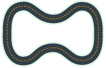

# General Reward Function toolkit for AWS DeepRacer

[AWS DeepRacer](https://aws.amazon.com/deepracer/)  is an integrated learning system for users of all levels to 
learn and explore **reinforcement learning**. The code presented here is a result of a ML competition, developed 
the "reward_function" used for the AWS DeepRacer model training. 

")

# The REWARD_FUNCTION code

There are many well-trained models published using hardcoded "logic" in the **reward_function()**. The logic of the reward is 
calculated based on the position of the car - determined by the nearest waypoint (the list of waypoints is fixed for 
every circuit track). Such an approach is working well for just one specific circuit (which the code is designed for). 
**The goal of the code presented here is oposit: nothing is hardcoded** and it should be working for any available circuit 
track. It calculates optimal speed based on the situation (**how far is the nearest turn**, how sharp it is, etc.) as well 
as ideal position before the turn. Better results you then can gain by a simple change of some basic parameters instead 
of hardcoding such logic into the reward_function() for each particular circuit.

This is the initial release of the "reward_function" in order to train, evaluate and participate in a competition 
(Honeywell AI day on July 30, 2019). Designed and trained to drive up to 5 m/s, implementing the following features:
  - **Car heading error**.
  - **Smooth steering angle**.
  - **Detection of a turn** in the "near horizon".
  - **Driving in optimised corridor** (inside the turn, outside when approaching).
  - **Optimal speed calculator** (depending on the "horizont").
  - Additional **basic calculations** - angle and distance between runtime waypoints, etc.

The "reward" is calculated by the RewardEvaluator class which has implemented above-mentioned set of methods (features) 
relevant for the calculation of the reward value based on input values describing the "situation" (conditions). 

```python
class RewardEvaluator:
    def get_car_heading_error(self): 
        ...
    def get_expected_turn_direction(self):
        ...
             
    .... implemented set of other basic functions
    
    def evaluate(self):
        ...implemented reward logic, calculated based on basic functions  
        return float(retval)

def reward_function(params):
    re = RewardEvaluator(params)
    return float(re.evaluate())

```

There were two good reasons to use "class" approach instead of simple function like many other examples 
available on the Internet: 
  - the first reason was **one Class is better for readability** (instead of functions and subroutines) and 
  - the second reason was **easier testing**.  

I recommend you to keep this approach unless you want loose a lot of time when looking for buggy code when you are 
designing more complex reward strategies. All these particular features presented here are having their tests 
(see **test_reward.py**). Extend it according to your needs. You safe a lot of time and it will pay back soon! 

From the set of implemented features, you can easily choose what best fits to your requirements. The calculation logic 
 itself you are supposed to implement in the method evaluate(). It is up to you to combine features, 
use weights, change logic, priorities...whatever you need in order to develop the reward function and train your best model :-)

The reward function presented here has been used for reInvent2018 circuit track. The track consist of the following waypoints:


The length of the track is approx 17.5 m, track width is 1.2 m. After 1 hour training, the model will most probably 
need in average 20 seconds to finish the lap. The challenge is to reach less than 10 seconds (training time required >2h).

### Log Analysis

I recommend you to use logs to analyze the performance of your model. The log is very valuable source of information you 
need to finetune the performance. Default query to start the analysis is as follows:

```python
 filter @message like /^SIM_TRACE_LOG/
| parse @message "SIM_TRACE_LOG:*,*,*,*,*,*,*,*,*,*,*,*,*,*,*" as episodes,steps,x,y,heading,steering,speed,action_taken,reward,done, all_wheels_on_track, progress,closest_waypoint_index,track_length,time
| sort by episodes,  closest_waypoint_index, steps asc
| limit 1000
```


Query example to check average speed sorted by closest wayipoints:

```python
parse @message "SIM_TRACE_LOG:*,*,*,*,*,*,*,*,*,*,*,*,*,*,*" as episodes,steps,x,y,heading,steering,speed,action_taken,reward,done, all_wheels_on_track, progress,closest_waypoint_index,track_length,time 
| stats avg(speed) by closest_waypoint_index
| filter @message like /SIM_/ 
| sort closest_waypoint_index asc
```

|Waypoint      | Avg speed [m/s]|
|:------------:| --------------:|
0|2.9113
1|2.9532
2|2.8414
3|2.8023
4|2.7969
5|2.7346
6|2.6869
7|2.6626
8|2.6879
9|2.7686
10|2.7719
11|2.7923
12|2.6962
| |... and more

You may need temporarily log input parameters or debug your code. To log anything you 
just do print() and the output is saved to log. For reach status logging uncomment  one
line (self.status_to_string()) in the evaluate() method. You can then find in the log logged status for every evaluation 
of the reward (each simulation/training step). This you will find very useful when debugging or finetuning the performance.

**WARNING:** Do not use logging to much. Unless it is worth to spend your money. For every 
logging attempt Amazon is charging you :-). A few hours of training can cost you a 
few dollars! Less you spend for logging more you can spend for training.  

```python
class RewardEvaluator:
    def status_to_string(self):
        status = self.params
        #if 'waypoints' in status: del status['waypoints']
        status['debug_log'] = self.log_message
        print(status)
    
    def evaluate(self):
        ...
        status_status_to_string    return float(retval)

def reward_function(params):
    re = RewardEvaluator(params)
    return float(re.evaluate())

```


# Training - Action space :
  - **Steering between -30 to +30 degrees** (steering angle granularity 5)
  - **Speed up to 5 m/s** (speed granularity 3)
  - **Gradient descent** batch size : 64
  - **Number of epochs** : 10
  - **Learning rate** : 0.0003
  - **Entropy** : 0.01
  - **Discount factor** : 0.999
  - **Loss type** : Huber 
  
# Summary

The reward function presented here "as-is" helps you to get into reinforcement learning. Within just a 5 minutes you can 
start training. Model trained on "re:Invent 2018" circuit for 3 hours can achieve in the simulator (as well as in real 
challenge) sufficient speed to finish the each lap in less then 20 seconds. Evaluation example : The model "Bowtle track" 
completes 100% of all trials. 


Fig #1 : re:Invent 2018 Circuit track used for training.



Fig #2. Bowtie circuit track used for evaluation.

To gain better results (aim is to train the car to drive as fast as possible and finish the lap in the shortest time 
possible), you need to further fine tune the reward_function code (in Python) and then set proper parameters for the 
Neural network. The design of the reward function itself is approx. 50% of the job. The rest you can gain by right 
training time and setting of training parameters. 

Good luck to use the code and find better combination of implemented features!

#### Links
https://github.com/aws-samples/aws-deepracer-workshops/tree/master/Workshops/2019-AWSSummits-AWSDeepRacerService/Lab0_Create_resources

https://github.com/aws-samples/aws-deepracer-workshops/tree/master/Workshops/2019-AWSSummits-AWSDeepRacerService/Lab1

https://codelikeamother.uk/using-jupyter-notebook-for-analysing-deepracer-s-logs

https://docs.aws.amazon.com/deepracer/latest/developerguide/deepracer-reward-function-input.html

https://aws.amazon.com/blogs/aws/new-amazon-cloudwatch-logs-insights-fast-interactive-log-analytics/

https://docs.aws.amazon.com/AmazonCloudWatch/latest/logs/CWL_QuerySyntax-examples.html

###### (c) Vilem Reznicek '19
