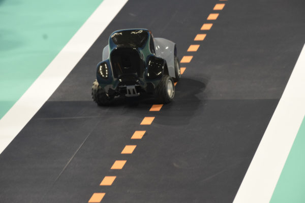
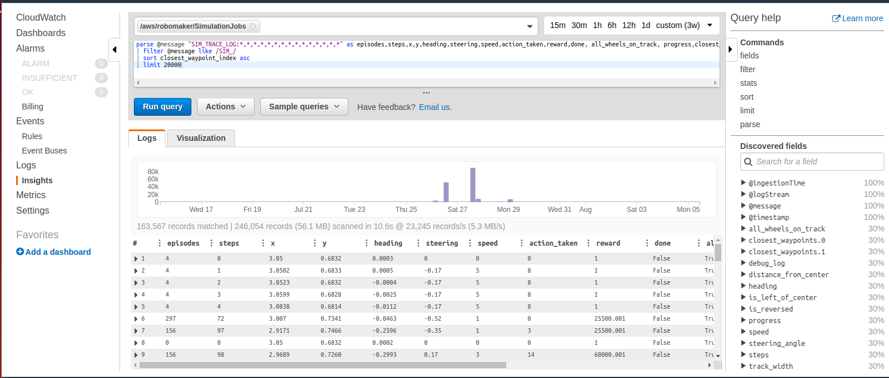

AWS DeepRacer – reward_function() to start easily
-------------

The code presented here is a reward function() for the [AWS DeepRacer](https://aws.amazon.com/deepracer/) 
 vehicle training tasks (Reinforcement Machine Learning). It is an outcome of the participation on 
 Honeywell AI day competition. 
 



Compared to other reward functions 
presented on Internet this code is bringing much better level of the problem abstraction and is allowing easy and safe 
changes in the reward strategies. This approach is a big benefit also for non-pythonic programmers allowing them to 
build complex reward strategy with a minimum knowledge of the Python syntax. See the example:

The functionality implemented in following fragment of the code
```python
def reward_function(params):
    waypoints = params['waypoints']
    closest_waypoints = params['closest_waypoints']
    heading = params['heading']
    reward = 1.0
    next_point = waypoints[closest_waypoints[1]]
    prev_point = waypoints[closest_waypoints[0]]
    track_direction = math.atan2(next_point[1] - prev_point[1], next_point[0] - prev_point[0]) 
    track_direction = math.degrees(track_direction)
    direction_diff = abs(track_direction - heading)
    if direction_diff > 180:
        direction_diff = 360 - direction_diff
    DIRECTION_THRESHOLD = 10.0
    if direction_diff > DIRECTION_THRESHOLD:
        reward *= 0.5
    return reward
```

can be easily replace by just a couple of lines:
```python
    reward = 1.0
    if abs(self.get_car_heading_error()) <=DIRECTION_THRESHOLD:
        reward *= 0.5
    return reward
```

More over in the code is possible to enable easy status and reward evaluation logging, each functionality can be tested 
(unit tests included) and expected output of some functions can be shown and finetuned prior the deployment (e.g. speed 
or distance to the center line before the turn, passing waypoint, …etc.). 

This is the full list of implemented functions and methods you can easily use and still combine with any 
underlying function or status value:
```python
    def get_way_point(self, index_way_point)
    def get_way_points_distance(previous_waypoint, next_waypoint)
    def get_heading_between_waypoints(previous_waypoint, next_waypoint)
    def get_car_heading_error(self)
    def get_optimum_speed_ratio(self)
    def get_turn_angle(self)
    def is_in_turn(self)
    def reached_target(self)
    def get_expected_turn_direction(self)
    def is_in_optimized_corridor(self)
```
The signatures are self explaining, for more detail please read commented lines in the source code. 
The "reward" is calculated by the RewardEvaluator class which has implemented above-mentioned set of 
 features relevant to the calculation of the reward value based on input values describing the "situation" 
 (conditions). 

```python
class RewardEvaluator:
    def get_car_heading_error(self): 
        ...
    def get_expected_turn_direction(self):
        ...
             
    .... implemented set of other basic functions
    
    def evaluate(self):
        ...implemented reward logic, calculated based on basic functions  
        return float(retval)

def reward_function(params):
    re = RewardEvaluator(params)
    return float(re.evaluate())

```

There were two good reasons to use "class" approach instead of simple function like many other examples 
available on the Internet: 
  - the first reason was **one Class is better for readability** (instead of functions and subroutines) and 
  - the second reason was **easier testing**.  

I recommend you to keep this approach unless you want lose a lot of time when looking for buggy code when you are 
designing more complex reward strategies. All these features presented here are having their tests 
(see **test_reward.py**). Extend it according to your needs. You safe a lot of time and it will pay back soon! 

From the set of implemented features, you can easily choose what best fits to your requirements. The calculation logic 
 itself you are supposed to implement in the method evaluate(). It is up to you to combine features, 
use weights, change logic, priorities...whatever you need to develop the reward function and train your best model :-)

The reward function presented here has been intended to be used for reInvent2018 circuit track but  you 
can use it for any existing circuit track. It will well perform for training as well for evaluation on any circuit.

The reInvent2018 track consists of the following waypoints:


The length of the track is approx. 17.5 m, track width is 1.2 m. After 1 hour training, the model will most probably 
need in average 20 seconds to finish the lap. The challenge is to reach less than 10 seconds (training time required >4h).

### Log Analysis

I recommend you to use logs to analyze the performance of your model. The log is very valuable source of information you 
need to fine tune the performance. Default query to start the analysis is as follows:

```python
 filter @message like /^SIM_TRACE_LOG/
| parse @message "SIM_TRACE_LOG:*,*,*,*,*,*,*,*,*,*,*,*,*,*,*" as episodes,steps,x,y,heading,steering,speed,action_taken,reward,done, all_wheels_on_track, progress,closest_waypoint_index,track_length,time
| sort by episodes,  closest_waypoint_index, steps asc
| limit 1000
```



Query example to check average speed sorted by closest wayipoints:

```python
parse @message "SIM_TRACE_LOG:*,*,*,*,*,*,*,*,*,*,*,*,*,*,*" as episodes,steps,x,y,heading,steering,speed,action_taken,reward,done, all_wheels_on_track, progress,closest_waypoint_index,track_length,time 
| stats avg(speed) by closest_waypoint_index
| filter @message like /SIM_/ 
| sort closest_waypoint_index asc
```

|Waypoint      | Avg speed [m/s]|
|:------------:| --------------:|
0|2.9113
1|2.9532
2|2.8414
3|2.8023
4|2.7969
5|2.7346
| |... and more

You may need temporarily log input parameters or debug your code. To log anything you 
just do print() and the output is saved to log. For reach status logging uncomment  one
line (self.status_to_string()) in the evaluate() method. You can then find in the log logged status for every evaluation 
of the reward (each simulation/training step). This you will find very useful when debugging or finetuning the performance.

**WARNING:** Do not use logging too much. Unless it is worth to spend your money. For every 
logging attempt Amazon is charging you :-). A few hours of training can cost you a 
few dollars! Less you spend for logging more you can spend for training.  

```python
class RewardEvaluator:
    def status_to_string(self):
        status = self.params
        #if 'waypoints' in status: del status['waypoints']
        status['debug_log'] = self.log_message
        print(status)
    
    def evaluate(self):
        ...
        status_status_to_string    return float(retval)

def reward_function(params):
    re = RewardEvaluator(params)
    return float(re.evaluate())

```

To gain better results (aim is to train the car to drive as fast as possible and finish the lap in the shortest time 
possible), you need to further fine tune the reward_function code (in Python) and then set proper parameters for the 
Neural network. The design of the reward function itself is approx. 50% of the job. The rest you can gain by right 
training time and setting of training parameters. 

Once you are fine with the reward logic, focus on settings right hyperparameters. For initial run keep default values 
and let it be lerning for approx 20 minutes. The car will be driving still crazy but you will get idea about the 
convergence and learning speed. My first option is to focus on gradient descent parameter to ensure the model is learning 
gradually and the learning curve is smooth. Do not be frustrated  once you let it train and after 2 hours the only 
achievement is 75% ration of successfully finished tasks. Do not panic - even this ration of finished tasks will let
your model already finish 95% of laps when on the real circuit track. 

Best performing models (Gopi, Neeraj, Poching) were trained for 6-12 hours, mainly using still somehow simple reward 
strategies. Models having hardcoded reward based on waypoints (designed for one particular circuit track) were 
demonstrating over fitting very soon - approx. after 6 hours of training.   

Good luck to use the code and find better combination of implemented features!

#### Links
https://github.com/aws-samples/aws-deepracer-workshops/tree/master/Workshops/2019-AWSSummits-AWSDeepRacerService/Lab0_Create_resources

https://github.com/aws-samples/aws-deepracer-workshops/tree/master/Workshops/2019-AWSSummits-AWSDeepRacerService/Lab1

https://codelikeamother.uk/using-jupyter-notebook-for-analysing-deepracer-s-logs

https://docs.aws.amazon.com/deepracer/latest/developerguide/deepracer-reward-function-input.html

https://aws.amazon.com/blogs/aws/new-amazon-cloudwatch-logs-insights-fast-interactive-log-analytics/

https://docs.aws.amazon.com/AmazonCloudWatch/latest/logs/CWL_QuerySyntax-examples.html

-------------

<sub>Vilem Reznicek | Reinforcement learning | Machine learning | Python | 2019 Honeywell AI day</sub>
